# 设计文档

## 概述

企业级管理系统采用前后端分离的现代化架构，后端使用FastAPI构建高性能API服务，前端使用Next.js 14 App Router构建响应式用户界面。系统核心围绕RBAC+权限管理体系设计，通过模块化架构确保高扩展性和可维护性。

## 架构设计

### 整体架构


### 技术栈选择

**后端技术栈:**
- FastAPI: 高性能异步Web框架，自动生成OpenAPI文档
- SQLAlchemy 2.0: 现代化ORM，支持异步操作
- Alembic: 数据库迁移工具
- FastAPI-Users: 用户认证和管理
- PyJWT: JWT令牌处理
- Loguru: 结构化日志记录
- Redis: 缓存和会话存储

**前端技术栈:**
- Next.js 14: React全栈框架，App Router
- TypeScript: 类型安全
- Tailwind CSS: 原子化CSS框架
- Shadcn/ui: 高质量UI组件库
- Zustand: 轻量级状态管理
- TanStack Query: 服务器状态管理
- Framer Motion: 动画库
- Lucide React: 图标库

## 组件和接口设计

### 后端模块化架构

```
/app
├── main.py                 # FastAPI应用入口
├── core/                   # 核心配置
│   ├── config.py          # 配置管理
│   ├── database.py        # 数据库连接
│   ├── security.py        # 安全相关
│   └── logging.py         # 日志配置
├── dependencies/           # 依赖注入
│   ├── auth.py            # 认证依赖
│   ├── permissions.py     # 权限校验依赖
│   └── database.py        # 数据库会话依赖
├── models/                 # SQLAlchemy模型
│   ├── user.py            # 用户模型
│   ├── role.py            # 角色模型
│   ├── permission.py      # 权限模型
│   ├── department.py      # 部门模型
│   └── associations.py    # 关联表
├── schemas/                # Pydantic模型
│   ├── user.py            # 用户响应模型
│   ├── role.py            # 角色响应模型
│   ├── permission.py      # 权限响应模型
│   └── common.py          # 通用响应模型
└── modules/                # 业务模块
    ├── auth/              # 认证模块
    │   ├── router.py      # 认证路由
    │   ├── service.py     # 认证业务逻辑
    │   └── schemas.py     # 认证专用模型
    ├── system/            # 系统管理模块
    │   ├── router.py      # 系统管理路由
    │   ├── service.py     # 系统管理业务逻辑
    │   └── schemas.py     # 系统管理专用模型
    └── profile/           # 个人中心模块
        ├── router.py      # 个人中心路由
        ├── service.py     # 个人中心业务逻辑
        └── schemas.py     # 个人中心专用模型
```

### 前端模块化架构

```
/src
├── app/                    # Next.js App Router
│   ├── (auth)/            # 认证相关页面
│   │   ├── login/         # 登录页面
│   │   └── register/      # 注册页面
│   ├── (main)/            # 主应用布局
│   │   ├── dashboard/     # 仪表板
│   │   ├── system/        # 系统管理
│   │   │   ├── users/     # 用户管理
│   │   │   ├── roles/     # 角色管理
│   │   │   ├── menus/     # 菜单管理
│   │   │   ├── departments/ # 部门管理
│   │   │   └── positions/ # 岗位管理
│   │   └── profile/       # 个人中心
│   ├── globals.css        # 全局样式
│   └── layout.tsx         # 根布局
├── components/             # 全局组件
│   ├── ui/                # Shadcn/ui组件
│   └── common/            # 自定义通用组件
│       ├── PageHeader.tsx # 页面头部
│       ├── UserAvatar.tsx # 用户头像
│       ├── DataTable.tsx  # 数据表格
│       └── PermissionGuard.tsx # 权限守卫
├── features/               # 业务功能模块
│   ├── auth/              # 认证功能
│   │   ├── api.ts         # 认证API调用
│   │   ├── components/    # 认证组件
│   │   ├── hooks/         # 认证Hooks
│   │   └── store.ts       # 认证状态管理
│   ├── system/            # 系统管理功能
│   │   ├── users/         # 用户管理
│   │   ├── roles/         # 角色管理
│   │   ├── menus/         # 菜单管理
│   │   ├── departments/   # 部门管理
│   │   └── positions/     # 岗位管理
│   └── profile/           # 个人中心功能
├── hooks/                  # 全局Hooks
├── lib/                    # 工具函数
│   ├── api.ts             # API客户端
│   ├── auth.ts            # 认证工具
│   ├── permissions.ts     # 权限工具
│   └── utils.ts           # 通用工具
├── stores/                 # 全局状态
│   ├── auth.ts            # 认证状态
│   ├── permissions.ts     # 权限状态
│   └── theme.ts           # 主题状态
└── types/                  # TypeScript类型定义
    ├── auth.ts            # 认证类型
    ├── user.ts            # 用户类型
    ├── role.ts            # 角色类型
    └── api.ts             # API响应类型
```

## 数据模型设计

### 核心数据模型

```mermaid
erDiagram
    User ||--o{ UserRole : has
    Role ||--o{ UserRole : assigned_to
    Role ||--o{ RolePermission : has
    Permission ||--o{ RolePermission : granted_to
    User }o--|| Department : belongs_to
    Department ||--o{ Department : parent_of
    User }o--o| Position : holds
    Position }o--|| Department : in
    
    User {
        uuid id PK
        string email UK
        string username UK
        string hashed_password
        string nickname
        string avatar_url
        uuid department_id FK
        uuid position_id FK
        boolean is_active
        boolean is_superuser
        datetime created_at
        datetime updated_at
    }
    
    Role {
        uuid id PK
        string name UK
        string description
        string code UK
        boolean is_active
        datetime created_at
        datetime updated_at
    }
    
    Permission {
        uuid id PK
        string name
        string code UK
        string description
        string resource
        string action
        uuid parent_id FK
        integer sort_order
        string permission_type
        boolean is_active
        datetime created_at
        datetime updated_at
    }
    
    Department {
        uuid id PK
        string name
        string code UK
        string description
        uuid parent_id FK
        integer sort_order
        string leader_id FK
        boolean is_active
        datetime created_at
        datetime updated_at
    }
    
    Position {
        uuid id PK
        string name
        string code UK
        string description
        uuid department_id FK
        integer sort_order
        boolean is_active
        datetime created_at
        datetime updated_at
    }
    
    UserRole {
        uuid user_id PK,FK
        uuid role_id PK,FK
        datetime created_at
    }
    
    RolePermission {
        uuid role_id PK,FK
        uuid permission_id PK,FK
        datetime created_at
    }
```



### 权限设计模式

**权限标识符格式:** `resource:action`
- `user:list` - 查看用户列表
- `user:create` - 创建用户
- `user:update` - 更新用户
- `user:delete` - 删除用户
- `role:assign` - 分配角色
- `system:config` - 系统配置

**数据权限级别:**
1. **全部数据权限** - 可以查看所有数据
2. **部门数据权限** - 只能查看本部门数据
3. **部门及下级数据权限** - 可以查看本部门及下级部门数据
4. **仅本人数据权限** - 只能查看自己的数据
5. **自定义数据权限** - 根据特定规则过滤数据

## 错误处理设计

### 统一响应格式

```typescript
interface ApiResponse<T = any> {
  success: boolean;
  data: T | null;
  error: string;
  code?: string;
  timestamp?: string;
}
```

### 错误处理策略

**后端错误处理:**
```python
# 自定义异常处理器
@app.exception_handler(HTTPException)
async def http_exception_handler(request: Request, exc: HTTPException):
    return JSONResponse(
        status_code=200,  # 统一返回200
        content={
            "success": False,
            "data": None,
            "error": exc.detail,
            "code": str(exc.status_code)
        }
    )
```

**前端错误处理:**
```typescript
// API客户端错误拦截
const apiClient = axios.create({
  baseURL: '/api',
  interceptors: {
    response: (response) => {
      if (!response.data.success) {
        toast.error(response.data.error);
        throw new Error(response.data.error);
      }
      return response.data.data;
    }
  }
});
```

## 测试策略

### 后端测试

**单元测试:**
- 使用pytest进行单元测试
- 测试覆盖率要求80%以上
- 重点测试权限校验逻辑和业务逻辑

**集成测试:**
- 使用TestClient测试API端点
- 测试权限控制的完整流程
- 测试数据库操作的正确性

**测试数据库:**
- 使用SQLite内存数据库进行测试
- 每个测试用例独立的数据库实例

### 前端测试

**组件测试:**
- 使用Jest和React Testing Library
- 测试组件的渲染和交互
- 测试权限控制组件的显示逻辑

**端到端测试:**
- 使用Playwright进行E2E测试
- 测试完整的用户流程
- 测试权限控制的前端表现

## UI/UX设计系统

### 设计令牌 (Design Tokens)

**色彩系统:**
```css
:root {
  /* 主色调 */
  --primary: 220 90% 56%;
  --primary-foreground: 220 90% 98%;
  
  /* 辅助色 */
  --secondary: 220 14% 96%;
  --secondary-foreground: 220 9% 46%;
  
  /* 状态色 */
  --success: 142 76% 36%;
  --warning: 38 92% 50%;
  --error: 0 84% 60%;
  
  /* 中性色 */
  --background: 0 0% 100%;
  --foreground: 220 9% 9%;
  --muted: 220 14% 96%;
  --muted-foreground: 220 9% 46%;
}

[data-theme="dark"] {
  --background: 220 13% 9%;
  --foreground: 220 90% 98%;
  /* ... 其他暗色主题变量 */
}
```

**字体系统:**
```css
.text-xs { font-size: 0.75rem; line-height: 1rem; }
.text-sm { font-size: 0.875rem; line-height: 1.25rem; }
.text-base { font-size: 1rem; line-height: 1.5rem; }
.text-lg { font-size: 1.125rem; line-height: 1.75rem; }
.text-xl { font-size: 1.25rem; line-height: 1.75rem; }
.text-2xl { font-size: 1.5rem; line-height: 2rem; }
```

**间距系统:**
- 基于8px网格系统
- 使用Tailwind CSS的间距类
- 确保组件间距的一致性

### 动画设计

**页面转场:**
```typescript
// 使用framer-motion的页面转场
const pageVariants = {
  initial: { opacity: 0, x: -20 },
  in: { opacity: 1, x: 0 },
  out: { opacity: 0, x: 20 }
};

const pageTransition = {
  type: "tween",
  ease: "anticipate",
  duration: 0.3
};
```

**微交互:**
- 按钮悬停和点击效果
- 输入框焦点状态
- 加载状态动画
- 列表项的进入和退出动画

### 响应式设计

**断点系统:**
```css
/* Tailwind CSS断点 */
sm: 640px   /* 平板 */
md: 768px   /* 小型桌面 */
lg: 1024px  /* 桌面 */
xl: 1280px  /* 大型桌面 */
2xl: 1536px /* 超大桌面 */
```

**布局适配:**
- 移动端：单列布局，抽屉式导航
- 平板端：双列布局，可收起侧边栏
- 桌面端：多列布局，固定侧边栏

## 安全设计

### 认证安全

**JWT令牌策略:**
- Access Token: 15分钟过期
- Refresh Token: 7天过期
- 令牌存储在HttpOnly Cookie中

**密码安全:**
- 使用bcrypt进行密码哈希
- 密码强度要求：至少8位，包含大小写字母、数字和特殊字符
- 支持密码重置功能

### 权限安全

**权限校验:**
- 后端每个API都进行权限校验
- 前端权限控制作为用户体验优化
- 数据权限在SQL查询级别进行过滤

**CSRF防护:**
- 使用CSRF令牌
- SameSite Cookie设置
- 验证Referer头

### 数据安全

**敏感数据处理:**
- 密码等敏感信息不在日志中记录
- 个人信息脱敏显示
- 数据库连接使用SSL

**审计日志:**
- 记录用户操作日志
- 记录权限变更日志
- 记录系统异常日志

## 性能优化

### 后端性能

**数据库优化:**
- 合理设计索引
- 使用连接池
- 查询优化和N+1问题避免

**缓存策略:**
- Redis缓存用户权限信息
- 缓存部门树结构
- API响应缓存

### 前端性能

**代码分割:**
- 路由级别的代码分割
- 组件懒加载
- 第三方库按需加载

**状态管理优化:**
- Zustand的选择器优化
- TanStack Query的缓存策略
- 避免不必要的重新渲染

**资源优化:**
- 图片懒加载和压缩
- 字体优化
- CSS和JS压缩

## 部署架构

### 容器化部署

**Docker配置:**
```dockerfile
# 后端Dockerfile
FROM python:3.11-slim
WORKDIR /app
COPY requirements.txt .
RUN pip install -r requirements.txt
COPY . .
CMD ["uvicorn", "main:app", "--host", "0.0.0.0", "--port", "8000"]

# 前端Dockerfile
FROM node:18-alpine
WORKDIR /app
COPY package*.json ./
RUN npm ci --only=production
COPY . .
RUN npm run build
CMD ["npm", "start"]
```

**Docker Compose:**
```yaml
version: '3.8'
services:
  backend:
    build: ./backend
    ports:
      - "8000:8000"
    environment:
      - DATABASE_URL=postgresql://user:pass@db:5432/dbname
      - REDIS_URL=redis://redis:6379
    depends_on:
      - db
      - redis
  
  frontend:
    build: ./frontend
    ports:
      - "3000:3000"
    environment:
      - NEXT_PUBLIC_API_URL=http://backend:8000
    depends_on:
      - backend
  
  db:
    image: postgres:15
    environment:
      - POSTGRES_DB=enterprise_admin
      - POSTGRES_USER=admin
      - POSTGRES_PASSWORD=password
    volumes:
      - postgres_data:/var/lib/postgresql/data
  
  redis:
    image: redis:7-alpine
    volumes:
      - redis_data:/data

volumes:
  postgres_data:
  redis_data:
```

### 生产环境考虑

**负载均衡:**
- Nginx反向代理
- 后端多实例部署
- 数据库读写分离

**监控和日志:**
- 应用性能监控
- 错误追踪
- 日志聚合和分析

**备份策略:**
- 数据库定期备份
- 配置文件版本控制
- 灾难恢复计划